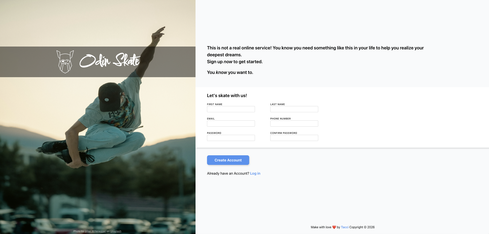

# Sign-Up Form

---

## 🔗 Live Demo

**Live Demo:** [taaccii.github.io/sign-up-form](https://taaccii.github.io/sign-up-form/)

---

## ✨ Features

- Two-column form layout with responsive fieldset
- Custom font via Google Fonts (Comforter)
- Full-height image sidebar with logo overlay and photo credit
- Input validation with `:user-invalid` pseudo-class
- Password pattern validation (minimum 8 alphanumeric characters)
- Focus state with custom blue border and box-shadow
- Button hover and active press effect with `translateY`
- Footer pinned to bottom with `margin-top: auto`

---

## 🛠️ Tech Stack

| Component | Technology |
|-----------|------------|
| **Markup** | HTML5 |
| **Style** | CSS3 |
| **Font** | Google Fonts — Comforter |
| **Reset** | Josh Comeau CSS Reset |

---

## 💡 What I Learned

- Managing complex layouts combining `position: absolute` and flexbox
- Using `::before` with `background-image` to size pseudo-element icons
- Difference between `:invalid` and `:user-invalid` for better UX
- Using `left: 50%` + `translateX(-50%)` to center absolute elements
- How `margin-top: auto` works inside a flex container to push elements to the bottom
- Practical use of `box-shadow` with directional offset to simulate natural light
- `transition` on the base element to animate both directions of `:active` state

---

## 📝 Notes

This project sat untouched for a few days and getting back into it felt rough at first. Once I unblocked myself, everything clicked — layout problems I had been overthinking turned out to be straightforward. It was a good reminder that stepping away and coming back fresh is part of the process. Most of the layout challenges I solved independently, applying what I had learned up to this point.

---

## 📄 License

This project is licensed under the **MIT License** — see [`LICENSE`](./LICENSE) for details.

---

## 👨‍💻 Author

**Taaccii**

- 📧 [taccidev@gmail.com](mailto:taccidev@gmail.com)
- 🐙 GitHub: [@Taaccii](https://github.com/Taaccii)
- 💼 LinkedIn: [alessandro-barletta-dev](https://linkedin.com/in/alessandro-barletta-dev)

---

> *Project built as part of [The Odin Project](https://www.theodinproject.com) Intermediate HTML and CSS curriculum.*